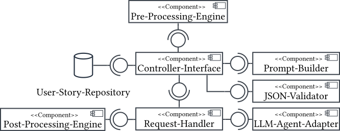
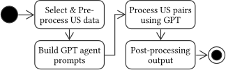

# Abstract

User stories (USs) are a widely used notation for requirements in agile software development.
In large software projects, redundancies between USs can easily occur, and unresolved redundancies can impact software quality.
While some redundancy may be acceptable, it is crucial for requirements engineers to know where redundancies occur in their projects.
To address this, we want to provide automated approaches to analyse sets of USs in order to prevent a decrease of software quality due to the realisation of redundant USs.
This paper presents two approaches to redundancy analysis.
The first approach is based on an a conceptual model for USs, called annotation graph,  containing their main actions and entities; the other uses large language models (LLMs).
We present the concepts and tools of both approaches and evaluate their potential and limitations by applying them to a large corpus of USs.
Our results show that the graph-based approach can correctly analyse a strict form of redundancy, while the inherently fuzzy LLM-based approach is more adept at recognising semantic redundancies.
Thus, this study contributes to the advancement of automated quality control of USs.

[Example User Story](ExampleSentence.pdf)
  
## Redundancy Detection with LLMs

Redundant requirements can be paired and between this pairs redundancies can be found.

We use the User Stories from [nlp-stories](https://github.com/ace-design/nlp-stories/tree/main) and [user story repo](https://zenodo.org/records/8136975).
We compared our LLM approach against a formal graph-based approach.

## Folder explanation

- Datasets: Contains the annotated [nlp-stories](https://github.com/ace-design/nlp-stories/tree/main)
- ExamplesForPmc: Contains some concrete examples how the actual interaction (prompts) is written based on the formal structure in [Prompt Examples](#prompt_examples).  
- results_gpt_approach
  - Results for general redundancy analyses (Redundancy_Analyse.xlsx)
  - Results for strict redundancy analyses (Strict_Redundancy_Analyse.xlsx)
  - Results for ignored US and time consumption (to find in the output_detections_highlighting_*.xlsx)
- results_graph_approach
  - Results of the strict redundancy analyses for G19 in JSON + CSV format
  - Results of the strict redundancy analyses for G22 in JSON + CSV format
- src_gpt_approach: containg the source code of our implementation. For installation, please refer to our installation and dependency description.
  - [ ] /controller: Implementation of the Fask API endpoint.
  - [ ] /future_work: Contains future experiments in jupyter notebook form (partly done).
  - [X] /prompt_structure : Contains the prompts used for our experiments.  
  - [X] /results: All results achieved during our experiments.
  - [X] /support_functions: As our implementation is based on a functional approach this src folder contains all abstracted functions.
  - [X] /support_functions_test: Tests for the support functions (pythonic style to organise tests).
  - [X] /utils: Utility functions.
  - [X] /Various Jupyter Notebooks: To connect and execute to our progam logic.
  - [X] /setup.py: -
- src_graph_approach:
  - Implementation of the graph-based strict redundancy analyses (to find in the main.ipynb)
  - ExperimentsWordSimilarity: Use of distance metrics to determine the similarity of words (annotations)

## Architecture

## Workflow

## IDE + Plugins

- VSCode
- Jupyter
- Jupyter Cell Tags
- Jupyter Keymap
- Pylint
- Pylance
- Python
- Python Debugger
- Python Environment Manager

## Dependencies

- Listed in the requirements.txt

## Installation guide

***Installation for the GPT approach***

- Install python == 3.12
- Create a .venv
- pip pip install -r /<usr_path>/requirements.txt
- pip install . in src
- configure [jupyter notebook env](https://jupyter-notebook.readthedocs.io/en/5.7.1/public_server.html)
- start jupyter notebook in the src_gpt_approach **folder**

***Installation for the Graph approach***

- Install python == 3.12
- Create a .venv
- pip pip install -r /<usr_path>/requirements.txt
- pip install . in src
- configure [jupyter notebook env](https://jupyter-notebook.readthedocs.io/en/5.7.1/public_server.html)
- start jupyter notebook in src (not in the src_graph_approach)

## Start-Up Env

- For Windows, we have developed scripts to automate the installation and recompilation of dependencies.
- After completing the GPT Approach Installation, you can use the **start_env_gpt_approach.ps1** script to launch all services for the GPT approach. ([Installation for the GPT approach](#gpt_installation))
**Note:** Each time the script is executed, the local source code is freshly compiled, and dependencies are verified for the correct versions. If discrepancies are found, they are reinstalled automatically.
- Similarly, after completing the Graph Approach Installation, you can use the **start_env_graph_approach.ps1** script to launch all services for the Graph approach. ([Installation for the Graph approach](#graph_installation))
**Note:** As with the Graph approach, executing this script will recompile the local source code and ensure dependencies are up-to-date, reinstalling them if necessary.
- Currently, only Windows is supported. Other operating systems such as [Linux](https://www.linux.org/), [MacOS](https://en.wikipedia.org/wiki/MacOS), and [Unix](https://en.wikipedia.org/wiki/Unix) are not yet supported. However, we plan to streamline the automated installation and recompilation process for these platforms in the future.
- Furthermore, we plan to develop a backend service for both strategies and containerize the application using [Docker](https://www.docker.com/). This will enable semi-technical staff to easily use the containers and integrate them into their applications.

## Env

You have to create a *.env*-file in the *src_gpt_approach* folder. The following entries have to be considered:

- OPENAI_API_KEY (Enter your API key here)
- MODEL_VERSION (GPT 3.5 = gpt-3.5-turbo points to gpt-3.5-turbo-0125, GPT-4o = gpt-4o-2024-05-13)
- TPM (Tokens-Per-Minute)
- RPM (Requests-Per-Minute)
- TOKEN_DELTA (Approximation of the Request Size to avoid GPT "Deadlocks")
- TEMPERATURE (e.g. 0.2)
- OUTPUT_EXCEL_NAME_WITH_JUST_TEXT #Insert here the name of the .xlsx-file which stores the results of experiments where only text has been used
- OUTPUT_EXCEL_NAME_WITH_ANNOTATIONS #Insert here the name of the .xlsx-file which stores the results of experiments where only annotations have been used
- OUTPUT_EXCEL_NAME_WITH_TEXT_AND_ANNOTATIONS #Insert here the name of the .xlsx-file which stores the results of experiments where annotations and text have been used
- OUTPUT_EXCEL_NAME_JUST_TEXTUAL #Insert here the name of the .xlsx-file which stores the results of experiments where only text has been used
- OUTPUT_EXCEL_STRICT_REDUNDANCY_NAME_JUST_TEXTUAL #Insert here the name of the .xlsx-file which stores the results of experiments where only text has been used and the prompt was tuned for strict redundancy
- OUTPUT_EXCEL_NAME_WITH_STRICT_ANNOTATIONS #Insert here the name of the .xlsx-file which stores the results of experiments where only annotations have been used and the prompt was tuned for strict redundancy
- THRESHOLD_REPAIR (Any number of repairs, e.g., "3")
- THREADING ("1" = ON, "2" = OFF)
- THREAD_MULTIPLICATOR (Any number for thread multiplication > 0)
- LIMIT  ("-1" =None, "n" = any number)
  
## Prompt Example

An Examples of a Prompt-Message-Chain (PMC) can be found in the *ExamplesForPmc*-Folder.
This PMC follows the structure of:

\[
M_{Sequence} = P_{Context-Framing} + \sum_{i=1}^{n} P_{Example}^{i} + P_{Process-Request} + \sum_{j=1}^{\tau} \left( P_{Agent-Answer}^{j} + P_{Repair-Request}^{j} \right)
\]

Where:

- \( n \in \mathbb{N} \) is the number of shots in a few-shot prompt.
- \( j \in \mathbb{N} \) is the number of repair attempts required to obtain a valid output, constrained by a preset repair threshold \( \tau \) that must not be exceeded.

The "+" operator indicates concatenation of strings, which includes insertion of a system simulation.

### Additional Details

1. \( P_{Context-Framing} \): Contains explanations and content for:
   - The actor role,
   - The redundancy definition (Def. 3),
   - The output format.

2. \( P_{Example}^{i} \): Consists of a US pair example containing an input and its corresponding redundancy output. These examples frame the LLM agent for the specific task. Here, \( n \) is the number of examples to insert.

3. \( P_{Process-Request} \): A prompt instructing the agent to analyze a particular pair of USs and respond with a JSON string.

4. If an invalid response is generated, the prompt is re-sent with additional prompts:
   - \( P_{Agent-Answer}^{j} \): Represents the invalid JSON response.
   - \( P_{Repair-Request}^{j} \): A prompt describing why the JSON response does not match the expected schema.

## Contributors

- [Lukas Sebastian Hofmann](lukas.hofmann@uni-marburg.de)
- [Alexander Lauer](alexander.lauer@uni-marburg.de)
- [Arno Kesper](arno.kesper@uni-marburg.de)
- [Gabriele Taentzer](taentzer@mathematik.uni-marburg.de)

## This Repo was submitted at REFSQ 2025

This Repo was created for 'Agile Development: Redundancy Analysis of User Stories with Graphs and Large Language Models' for the [Requirements Engineering: Foundation for Software Quality (REFSQ) 2025](https://2025.refsq.org/)
